<div align="center">


<a href="https://github.com/adarshanrai">
  
</a>

<br/><br/>


<br/><br/>

<a href="#profile"></a>
<a href="#echoes"></a>
<a href="#forte"></a>
<br/>
<a href="#collection"></a>
<a href="#data"></a>
<a href="#contact"></a>

</div>

<br/>

<a name="profile"></a>

<div align="center">
</div>

<details>
<summary><b>◈ Tune your frequency</b> &nbsp;<sub>pick who you are</sub></summary>

<br/>

<details>
<summary>🎯 &nbsp;I'm hiring</summary>

<br/>

I'm open to **Frontend Developer** and **UI/UX Developer** roles. The fastest way to see my work is to open the Echo Records below, which are all live sites. You can reach me on [LinkedIn](https://www.linkedin.com/in/adarshan-rai-a09798324/) or by [email](mailto:adarshanrai76@gmail.com).

</details>

<details>
<summary>🤝 &nbsp;I want to collaborate</summary>

<br/>

I like projects where design and code meet: Figma to React, clean UI, and tools that make digital content easier to use. Send me a signal through the Communicator section.

</details>

<details>
<summary>👀 &nbsp;I'm just exploring</summary>

<br/>

Welcome. Start with **Echo 01 (Verbis)**, a translation site for Sikkimese local languages, then try **The Daily Grind Café**, which started as a Figma design.

</details>

</details>

<details>
<summary><b>◈ Open resonator.ts</b> &nbsp;<sub>the profile as code</sub></summary>

```typescript
const resonator = {
  title: "UI/UX Developer | Frontend Developer",
  stack: ["HTML", "CSS", "JavaScript", "React", "Flutter", "Node.js", "Express", "MongoDB", "Figma"],
  launchedProjects: ["Verbis", "The Daily Grind Café", "CSE Build Lab", "Image to PDF"],
  certifications: [
    "MongoDB Node.js Developer Path",
    "AI For UX Designers (Free Academy.ai)",
    "Basics of UI/UX (Simplilearn)",
    "Figma UI UX Essentials (Lementro)",
    "Design Thinking for Beginners (Simplilearn)",
    "Mobile Application UI UX Design in Figma (Lementro)",
  ],
  status: "BCA Student @ Medhavi Skills University | Building UI/UX & frontend projects",
  openTo: ["Frontend Developer roles", "UI/UX Developer roles"],
};
```

</details>

<br/>

<a name="echoes"></a>

<div align="center">

<sub>Click an Echo to open the live site.</sub>

<br/>

<a href="https://www.verbis.me/">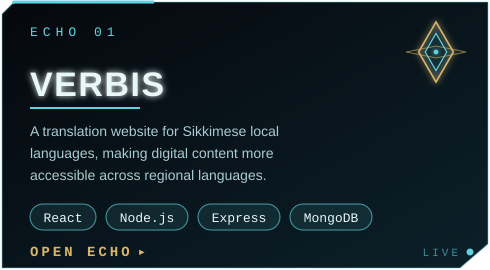</a>
<a href="https://daily-grind.adarshanrai76.workers.dev/">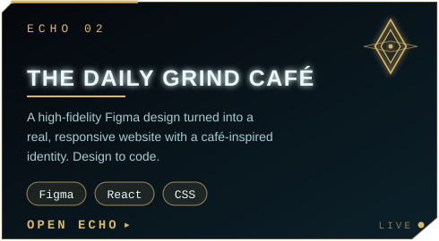</a>
<br/>
<a href="https://cse-build-lab.pages.dev/">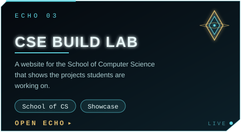</a>
<a href="https://image-to-pdf-36d.pages.dev/">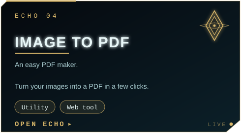</a>

</div>

<br/>

<a name="forte"></a>

<div align="center">


<br/>


</div>

<br/>

<a name="collection"></a>

<details open>
<summary><b>◈ Certifications (6)</b> &nbsp;<sub>click to collapse</sub></summary>

<br/>

| Echo | Certification | Issuer |
|:----:|:--------------|:-------|
| ◆ | MongoDB Node.js Developer Path | MongoDB |
| ◆ | AI For UX Designers | Free Academy.ai |
| ◆ | Basics of UI/UX | Simplilearn |
| ◆ | Figma UI UX Essentials | Lementro |
| ◆ | Design Thinking for Beginners | Simplilearn |
| ◆ | Mobile Application UI UX Design in Figma | Lementro |

</details>

<br/>

<a name="data"></a>

<div align="center">


<br/>


</div>

<br/>

<a name="contact"></a>

<div align="center">

<a href="https://www.linkedin.com/in/adarshan-rai-a09798324/"></a>
<a href="mailto:adarshanrai76@gmail.com"></a>

</div>

<details>
<summary>🔓 &nbsp;<b>Hidden Echo</b> &nbsp;<sub>you found it</sub></summary>

<br/>

<div align="center">

This profile is built from hand-made animated SVGs, so there is no JavaScript and no images borrowed from anywhere. Thanks for poking around. 🌊

</div>

</details>

<div align="center">

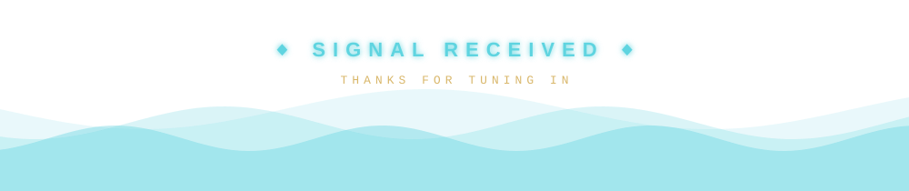

<sub>Fan-made theme inspired by the look and feel of Wuthering Waves. Not affiliated with or endorsed by Kuro Games. All artwork on this page is original.</sub>

</div>
